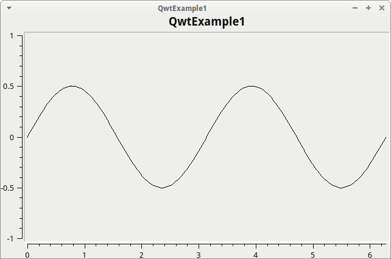

# QwtExample1

[](https://travis-ci.org)

[](https://www.codecov.io)

[](https://travis-ci.org/richelbilderbeek/QwtExample1)
[](https://codecov.io/github/richelbilderbeek/QwtExample1?branch=master)

Qwt example 1: scatter plot is a Qwt example that shows how to create a scatter plot.



Other Qwt examples can be found at [richelbilderbeek's Qwt GitHub](https://github.com/richelbilderbeek/Qwt).

## Run locally

```
./download_other_githubs.sh
./install_other_githubs.sh
qmake
make
./QwtExample1
```